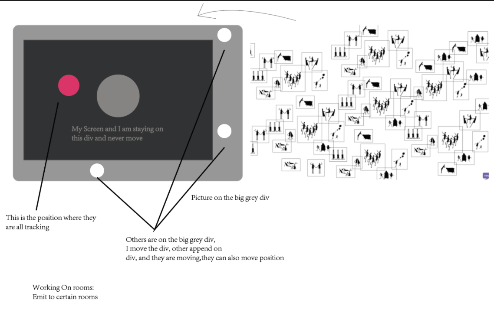

# Nice to SEE You
[link to the project](https://nice-to-see-youu.glitch.me/)

Background:

What does distance mean? Digital technologies make us so close yet so far away from each other.  We construct our digital identities in different social medias to expand our social networks. Sending chat messages, sharing moments and clicking the “like” button become the only way we convey our thoughts and emotions. 

We no longer interact with people around us. We ignore the poetic moments in our real life. We forget the feeling to hear, to see, and to connect. We are isolated from each other as we attempt to connect digitally. Every day we see nothing but stare at our screens. Are we becoming more intimate with each other or more alienated?

The alieness trapped you into a black circle where you can only see the happy images of other people gathering together. To escape from the dark, you need to follow the sound to find others. You will finally reach a tree, which is the same spot other is finding. This game require players' great patient and courage since you need to explore the dark by yourself. You may or maynot encounter others throughout your trip.

This is the introduction of our project. From my perspective, I got this idea because I thought back to my experiences when I interacted with other people. Online interaction always gave me the feeling that I could always find others with easy motion like pressing the send button, calling someone, and posting moments. However, I do enjoy the time when I didn't have phone and I have to tried so hard to find and reach the others. And the hardness of finding left me deep impression while also enhance me to value the relationship. So I want to recreate this feeling(finding people with great effort) through online interaction. By trapping player into a circle and surrounded by dark, he will be eager to find someone since no one likes being trapped in the dark. Also, with the large map, he will feel the finding time is long and require his effort to listen to the sound and keep trying different directions. 

We require the user to meet under a tree. For me, the tree is a representative of the places where I easily find friends to play with(like playground, the shops outside my primary school. etc..). When the player reach the tree, he may or may not meet the others. It's like we sitting down a tree, waiting for someone to find us. During this waiting time, we hope someone to find us. When they find us, we will feel more happy like after a long desert we finally meet someone to escape the dark. 

 

Then when the player met another player under the tree, a prompt will appear, and the play can input message then they will be redirect to a new page where they can see the people who have successfully escape the dark. By designing this, I want to break the bouderies of time and let players connected with all the players who met and encounter another person. It's like we see each other and we feel each other.

# TECHNICAL CHALLENGES
In this project, we explore socket.io, room, express redirect and the sound API.

1. Who is moving

In the project, we need to move a lot of things. First, the user need to move the div, which contain the big map with the others' ball append on that big div. So when I animate the big div, the people image and the others players' position is moving. Since I am not moving, while I am moving the others, I can find others. Also, I use get_all_ball to detect who is connected and when someone is disconnect, it will easily update. I use new_ball and the move ball function to track new players and when the other is moving, their balls on my screen is also animated. Making clear of the animation is one challenage. I learned the code from a youtube tutorial and the source code is cited in the citation. 

  

2. Room and express

I also learned with rooms, where I push the id and put two of the user into a group. When two is reached, the new player will be assign to a new room and wait another player. However, when we were testing, we found the room laggy so we partly drop this idea, but I want to further explore the room idea. For the express, part, I appied the idea I used in mini06, where when you solve the puzzle, we redirect to another page, where you can see who also finish the puzzle, building up the interaction. I applied it in projectC, but we suffer a bit from calculating two players' distance to triger the escape button. 

# Compromises and Shortcomings

The compromises me made is since we are not 100% sure the express part will work well, we didn't present. Also, when we showed on another big screen mac, the background image not showing. I also still learning why this happen and how to fix it. Also, like professor Leon mentioned, the sound can be emit from different players (make their own sound) instead of emit from the tree. I will further work on the express part and the sound part cause I really like this project. Also I will keep drawing the map, to make it coherent with the animation.

# Last but not least...

With great thanks to Sophie, who is an excellent teammate. With great thanks to Professor Leon, who guided us to this idea and helped us through our building process. With great thanks to Thomas, who helped me with room. 

# Code Citation
Atinux. “Atinux/Liveballs: A Mutliclient Chat with Balls for Each Client, You Can Move with Your Mouse and Chat with Other Persons in Realtime.” GitHub, github.com/Atinux/liveBalls. 

# Code(with multiple versions on github and some are on glitch)
[current site](https://glitch.com/edit/#!/nice-to-see-youu)

[fixing express](https://glitch.com/edit/#!/project-c-oldversion)

[room-version-trying](https://glitch.com/edit/#!/room-version)

